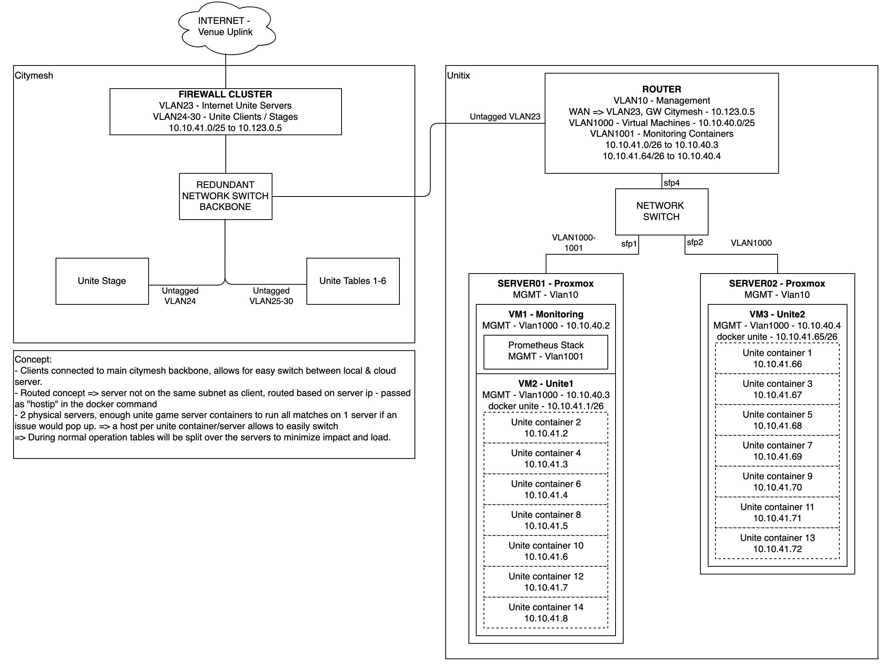

# Ansible - Pokémon Unite LAN Server Setup
<p align="center">
  
  
</p>

## Overview
<p align="center">
  
</p>

## Ansible Setup
1. Create a python virtual environment:    
`python3 -m venv ~/ansiblevenv`
2. Activate the ansible venv: (you need to do this everytime to execute playbooks).   
`source ~/ansiblevenv/bin/activate`
3. Install the ansible python requirements:    
`pip3 install -r requirements.txt`
4. create a vault-client.sh file containing the vault pass to decrypt the encrypted variables (such as the docker login). The file can contain the password cleartext or be a script that returns the password (such as 1password-cli).

## Hosts
- The hosts are being pulled from netbox as inventory. (you can manually create an inventory if required)
  - they are linux virtual machines with docker installed
  - make sure docker firewall is disabled and you have a way to tell iptables/nftables to dstnat external port to internal port on the same container ip. 
    (this looks something like this)
```
chain PREROUTING {
    type nat hook prerouting priority dstnat; policy accept;
    iifname "ens18" ip daddr 10.10.41.66 udp dport 56507 counter dnat ip to 10.10.41.66:6650 comment "DNAT to unite01 - 56507"
    iifname "ens18" ip daddr 10.10.41.66 udp dport 56508 counter dnat ip to 10.10.41.66:6788 comment "DNAT to unite01 - 56508"
    iifname "ens18" ip daddr 10.10.41.66 udp dport 56509 counter dnat ip to 10.10.41.66:10030 comment "DNAT to unite01 - 56509"
    iifname "ens18" ip daddr 10.10.41.67 udp dport 56507 counter dnat ip to 10.10.41.67:6650 comment "DNAT to unite03 - 56507"
    iifname "ens18" ip daddr 10.10.41.67 udp dport 56508 counter dnat ip to 10.10.41.67:6788 comment "DNAT to unite03 - 56508"
    iifname "ens18" ip daddr 10.10.41.67 udp dport 56509 counter dnat ip to 10.10.41.67:10030 comment "DNAT to unite03 - 56509"
}
```

## Running
All non unite / euic specific roles are located at: https://github.com/33Fraise33/personal-ansible/

Run the common role: 
- This runs the base required items for the linux host os.
This will setup:
  - hostname, ntp, users, packages, dns resolve config, node exporter and networking with ifupdown2. 

Run the docker role and the monitoring role. 
- Docker will setup docker on linux, install portainer & cadvisor.
- The monitoring role will install:
  - prometheus, blackbox exporter and grafana. Setup of grafana is done on the go, no config is maintained atm.

Run the unite.yml role:    
`ansible-playbook -i <inventory> playbooks/unite.yml --diff`
- this will create a docker servers depening on the host variables, variables should looks like: 
```
servers_to_provision:
      - "02"
unite_servers:
  - id: "02"
    image: <docker image tag>
    network:
      name: unite  # created in docker role, a new bridged network with a static route from the firewall towards this docker network
      ip: <static ip for container>  # this is the ip that will be passed to the hostip command in the docker container
    whitelist_users:
      - id: <unite support id>
        comment: <general reference for own ease of identifying>
```

This will also create a small script which exports the users from the logs into a file. This file will be read by prometheus node_exporter to be exposed to prometheus for dashboarding in grafana.

## Unite Specific

### Network Setup
- For the EUIC 2026 the setup has changed as in: clients are ROUTED to the server.
  - As the server is running DNAT anyway this indicates L2 is not required.
  - The routed setup allows us to give the host/admin a different phone and connecting the whole lobby to a different server (if the firewall allows this).
  - This setup allows a quick swap of a host device without having to have 2 phones per server or changing vlan of the clients to another server. 
- The hostip passed to the docker container is the external ip clients will try to connect to when the cloud nudges the client to the local server.
- During the lobby phase you will see udp packets towards 56509 to test the latency, this will also show the "local server connection speed" button in the client lobby.

### Whitelist
When the server is running support ids can be whitelisted in the server. 

**WARNING: ONLY WHITELIST A SUPPORT ID ON 1 SERVER.**   
When whitelisting it seems that the unite game cloud tells the client to which server to connect locally, if you have whitelisted on multiple local servers it might push another local server to the whitelisted client. 

After you have read the above carefully, run: 
`ansible-playbook -i <inventory> playbooks/unite.yml --diff --tags whitelist`

## Future Events
- Change the container output to more usefull stuff, the only thing it mentions is pushing logs to the cloud.
  - "client x has connected", "client x has disconnected" ...
- Reasons why there are differente docker images per server, what is the difference, can we pass this to the command line or as a config file instead of a different 10GB image per server. => env variables, command line variables or a config file.
  - Allow to override the server name "IDC_1" this is shown in the ingame client under the "local server connection speed" screen.
  - Allow to disable the cloud log push, this is creating more network throughput than required. 
- Clean up docker images better, there are a lot of operational files in there which are not needed (saw some .tar.gz, this could be dropped)
  - look at distroless containers to improve scaling this image
- Change the monitor script to a prometheus scrapable endpoint. It would be nice to also return the game phase and some client details?
  - report: lobby/paused/live => thiw way we can create automatic trigger for server admin to go check with judges
  - current score
  - metrics of critical services (tconnd, relaysrv,...)
- Better stats in game
  - change wifi icon to latency in ms when in tournament mode and connected to local server
  - packet loss counter?
- Listen on ports clients connect to instead of having to NAT them
  - This would also help if more ports are being added in the future, this year a new port was added which was initially forgotten.
- Sometimes there is an issue where more player are reported than actually in game.
  - 16 players on stage, 12 on normal stations while there are 15 on stage and 11 on normal stations.

## General issues
- Phone not detecting ethernet (before starting game)
  - Solution:
    - unplug the dongle, turn the usb-c connector around
    - unplug the dongle, unplug the power of the dongle, plug the dongle back in, then plug the power back in
  => Can be confirmed by looking at the lights on the ethernet dongle (they should blink) if they don't blink restarting the game makes no difference
- Phone showing an ethernet connector with an exclamation mark:
  - double check automatic date & time settings
  - phones do a captive portal check but without valid date the ssl certificate might be deemed invalid, setting the connection to "non functioning"
- Player getting disconnected
  - Player is unable to rejoin the server, restarting the game might fix this, most of the time a second or third restart is needed
  - Worst case let the player join on a different device with the same account credentials
